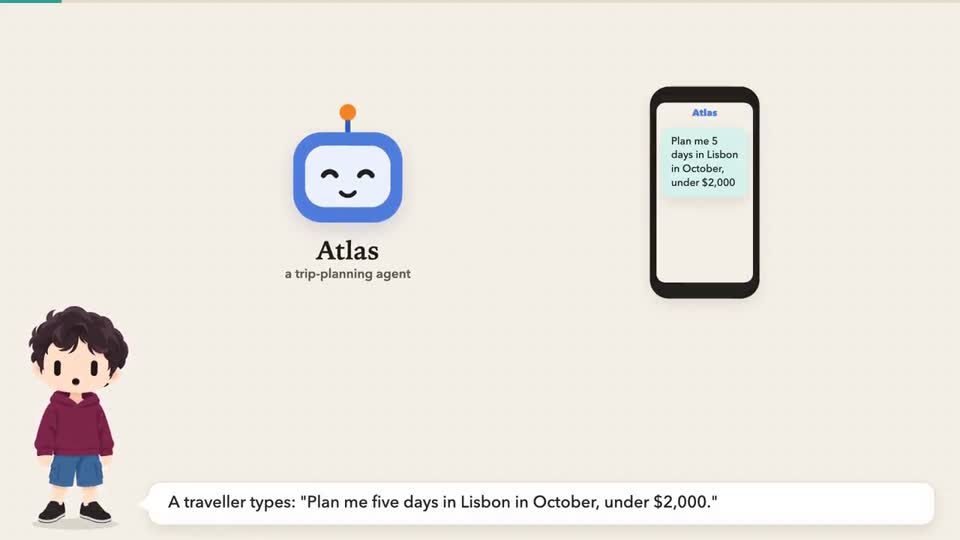
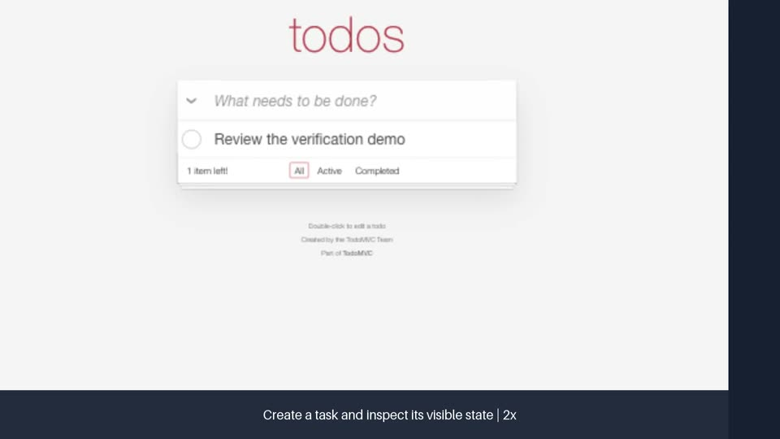

# Skills

Agent skills for planning, implementation, review, verification, and visual explanations. Each skill has a `SKILL.md` entry point; references and scripts travel with it.

Original skills and scripts are [MIT licensed](LICENSE), with third-party notices and explicit exceptions in [licensing and attribution](LICENSING.md). This is a local release candidate.

## Skills

| Skill | What it does | Example request |
| --- | --- | --- |
| [babysit-pr](skills/babysit-pr/SKILL.md) | Monitors CI and review feedback, validates findings, and handles fixes within scope. Attribution review pending. | “Watch this PR until reviews and CI settle.” |
| [boundary-discipline](skills/boundary-discipline/SKILL.md) | Places validation at system boundaries and keeps internal invariants clear. | “Review where this service validates input.” |
| [council](skills/council/SKILL.md) | Collects independent model perspectives and synthesizes disagreements. | “Get a council review of this design.” |
| [create-pr](skills/create-pr/SKILL.md) | Creates a focused PR with a clear problem statement and behavior evidence. | “Open a PR for this change.” |
| [explainer-video](skills/explainer-video/SKILL.md) | Builds narrated animated videos from a subject or document. | “Explain this architecture in a five-minute video.” |
| [grilling](skills/grilling/SKILL.md) | Resolves design decisions through focused rounds of questions. | “Grill me on this feature plan.” |
| [html-communication](skills/html-communication/SKILL.md) | Presents reports, comparisons, plans, and mocks as readable HTML. | “Present these findings as an HTML report.” |
| [measure-change](skills/measure-change/SKILL.md) | Compares behavior or performance with explicit baselines and evidence. | “Measure whether this optimization helps.” |
| [pr-clean-code-review](skills/pr-clean-code-review/SKILL.md) | Reviews complexity, contracts, duplication, and maintainability. | “Review this PR for unnecessary complexity.” |
| [pr-spec-review](skills/pr-spec-review/SKILL.md) | Checks a PR against requirements and expected behavior. | “Does this PR satisfy the issue?” |
| [pr-walkthrough](skills/pr-walkthrough/SKILL.md) | Explains a PR through concrete before/after behavior. | “Walk me through this PR.” |
| [resume-work](skills/resume-work/SKILL.md) | Reconstructs context and current state before continuing a task. | “Resume this interrupted task.” |
| [review-loop](skills/review-loop/SKILL.md) | Coordinates spec review, code review, fixes, and PR monitoring. | “Run a review loop on this PR.” |
| [type-system-discipline](skills/type-system-discipline/SKILL.md) | Uses types to encode valid states and reduce defensive branching. | “Review this domain model.” |
| [typescript-best-practices](skills/typescript-best-practices/SKILL.md) | Guides TypeScript inference, validation, and maintainable typing. | “Apply these rules to this TypeScript change.” |
| [use-claude](skills/use-claude/SKILL.md) | Runs Claude CLI tasks with scoped prompts and resumable sessions. | “Ask Claude to review this implementation.” |
| [use-codex](skills/use-codex/SKILL.md) | Runs Codex CLI tasks and preserves outputs and continuation context. | “Have Codex investigate this failure.” |
| [use-cursor](skills/use-cursor/SKILL.md) | Runs Cursor CLI tasks with model selection and session continuity. | “Ask Cursor for a second opinion.” |
| [verify-change](skills/verify-change/SKILL.md) | Verifies running behavior and records API, CLI, worker, or requested browser evidence. | “Verify this change and record the browser flow.” |
| [write-skill](skills/write-skill/SKILL.md) | Writes and refines skills with focused instructions and references. | “Turn this workflow into a reusable skill.” |

## Examples

### Explainer video

[Watch or download the full explainer](examples/explainer-video/ai-agent-clouds-compared.mp4) — approximately 23 minutes, compressed to 720p for this repository. The original render is 1080p. This is a dated presentation example, not current product guidance. Its [scene sources and briefs](skills/explainer-video/examples/agent-clouds-compared/) are included.

### Verify change

[Watch the 18-second demo](examples/verify-change/review.mp4) — a real browser recording of task creation, completion, and filtering on TodoMVC, edited with captions, zooms, and speed labels. [Read the evidence and limits](examples/verify-change/report.md). This demonstrates evidence collection; no application code was changed. Persistence after navigation was not verified.

#### Why edit the verification recording?

A raw browser recording often includes long waits and actions whose purpose is unclear to a reviewer. `verify-change` turns it into evidence that is quicker to inspect: it accelerates idle periods, keeps important results readable, zooms toward relevant controls, and adds captions explaining the observed steps. When synchronized click coordinates are available, click highlights show actions that may not move the physical cursor. Editing preserves every source interval in order, including errors; speed labels distinguish accelerated footage from real-time behavior.

The renderer also writes `transcript.srt`: a timed text track of the explanatory captions, not a verbatim speech transcript. It lets reviewers read or load the steps as subtitles. A source-to-output timing map supports checking the edit against the original. Captions describe what was observed; they do not turn an unverified outcome into a pass. See the [video workflow](skills/verify-change/references/video.md).

#### Verify while you keep working

The browser workflow is designed to reduce interruptions while a person and an agent share a computer. Foreground automation can steal focus from a text field, move the pointer, or send typing into the person’s active document. The skill prefers controls directed at the agent’s own browser or window. Its default [macOS virtual-display setup](skills/verify-change/references/local-display-test.md) puts the test browser on another display and uses targeted accessibility controls so ordinary interactions can run without taking over the person’s foreground app.

A virtual monitor does **not** create a separate keyboard, mouse, or operating-system input session. The workflow checks foreground focus and pointer behavior on the actual machine before relying on background control; opening an extension panel may still briefly take focus. If controls repeatedly interrupt the person’s work, the agent must report the limitation and use an available isolated runtime, such as a separate desktop session or VM, for those steps. The goal is to keep verification out of the person’s way without claiming isolation that the setup does not provide.

Video links open the repository file; download the MP4 if your viewer does not provide inline playback.

## Use

Copy the desired skill directories into your agent’s configured skills directory, preserving their references and scripts. Keep related skills as siblings so relative links work. `review-loop` uses both PR review skills, `babysit-pr`, and `html-communication`; `council` uses the CLI wrappers; `verify-change` references `create-pr`; the TypeScript skills link to the principle skills.

Read each skill before enabling it. Invocation metadata and available tools depend on the host. Supply project setup, authentication, fixtures, output locations, and permission rules through your own project instructions. Browser verification runs only when requested.

## Requirements and portability

Most skills are Markdown instructions. PR workflows require Git and an authenticated GitHub CLI; model wrappers require their respective installed CLIs and an available model. Select models from the installed tool’s supported choices.

The explainer toolchain uses Bash, Node.js, Python, FFmpeg, Playwright/Chromium, and Kokoro narration dependencies. Its setup script downloads these dependencies and voice assets. Bash scripts target Linux/macOS and a compatible Windows environment such as WSL; native Windows support has not been tested. User cache/config paths can be overridden through the documented environment variables.

Verification uses native computer-use controls, Playwright/Chromium lifecycle and telemetry, a macOS virtual display, and OpenScreen editing with Python, Pillow, FFmpeg/ffprobe. The bundled renderer requires the macOS network-denial sandbox and an explicitly supplied OpenScreen executable. This preserves the original verification stack: it is independent of personal installation paths, but its bundled video rendering workflow is macOS-specific. API/CLI verification does not require a virtual display. Follow the active host’s tool-selection rules.

## Credits

`grilling` is adapted from Matt Pocock’s skills. `boundary-discipline`, `type-system-discipline`, and `typescript-best-practices` are adapted from Lauren Tan’s pstack. Their upstream MIT licenses and source references are preserved in their directories. `babysit-pr` and `html-communication` are inspired by Theo (t3.gg)’s own skills shared in his livestreams. See [LICENSING.md](LICENSING.md) for the remaining review items.

The default presenter is included under MIT. Example videos and posters are excluded; see [licensing and attribution](LICENSING.md).
